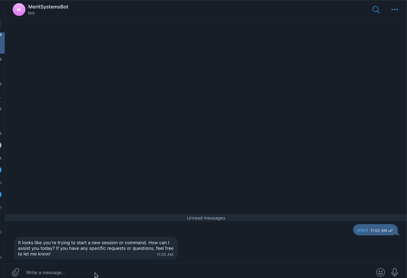
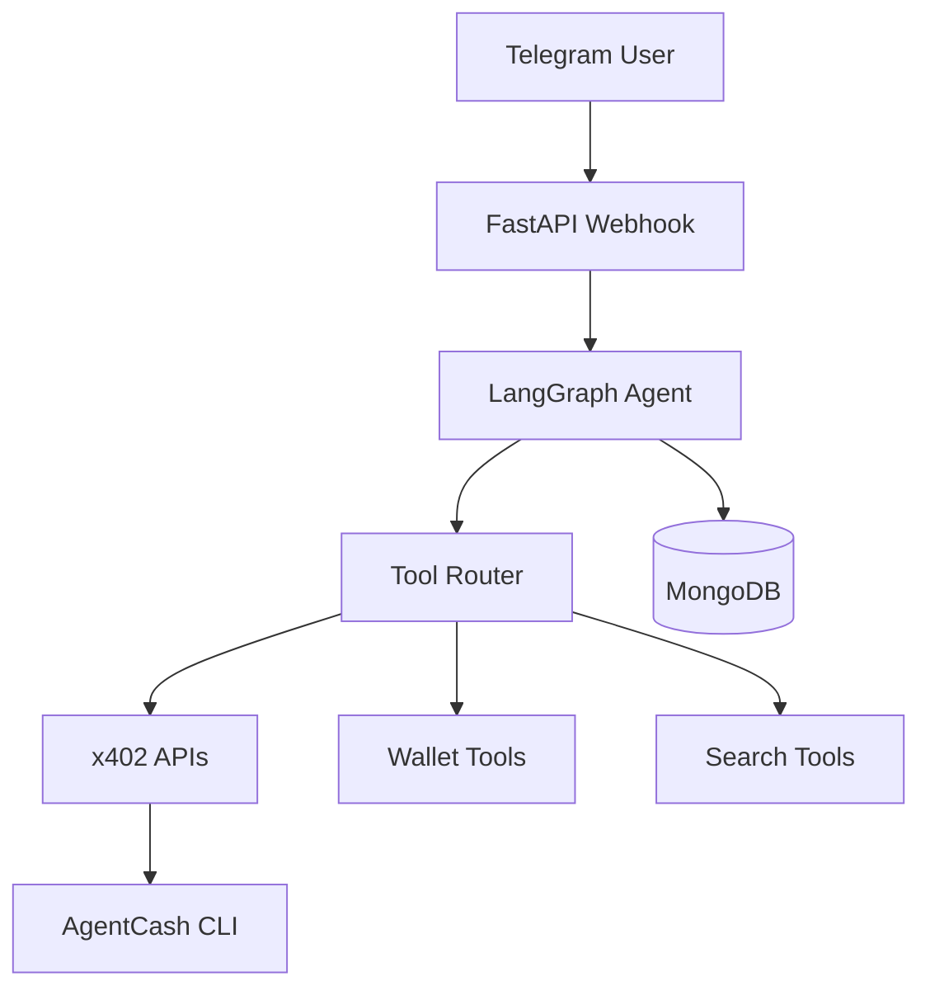

# Agentic Commerce Merit System

An AI-powered API marketplace agent capable of:

- discovering APIs
- executing x402 paid APIs
- handling conversational memory
- integrating with Telegram
- orchestrating tools using LangGraph

The system stores conversational history in MongoDB and supports payment-gated APIs using AgentCash and x402.

---
## Demo



# Features

- LangGraph-powered agent orchestration
- MongoDB conversational memory
- Telegram bot integration
- x402 payment-enabled API execution
- AgentCash CLI integration
- FastAPI backend
- Tool routing + slot filling
- Conversation persistence
- Async MongoDB support via Motor

---

# Architecture



---

# Tech Stack

- Python
- FastAPI
- LangGraph
- LangChain
- MongoDB
- Motor
- OpenAI
- Telegram Bot API
- Node.js
- AgentCash
- x402

---

# Environment Variables

Create a `.env` file:

```env
OPENAI_API_KEY=your_openai_key

MONGODB_URI=your_mongodb_uri
MONGODB_DB=your_database_name

TELEGRAM_BOT_TOKEN=your_telegram_bot_token
```

---

# Installation

## Clone Repo

```bash
git clone <your_repo_url>
cd Agentic-Commerce-Merit-System
```

## Create Virtual Environment

```bash
python -m venv venv
source venv/bin/activate
```

## Install Python Dependencies

```bash
pip install -r requirements.txt
```

## Install Node + AgentCash

```bash
npm install -g agentcash
```

---

# Running Locally

## Start FastAPI Server

```bash
uvicorn main:app --reload
```

---

# Telegram Webhook

Set webhook:

```bash
curl -X POST "https://api.telegram.org/bot<YOUR_BOT_TOKEN>/setWebhook" \
-d "url=https://YOUR_DOMAIN/telegram-webhook"
```

---

# Example Telegram Update

```json
{
  "message": {
    "chat": {
      "id": 785862166
    },
    "text": "Find me some crypto APIs"
  }
}
```

---

# Example x402 API Execution

```python
execute_x402_tool(
    url="https://api.printmoneylab.com/api/v1/kimchi-premium?symbol=BTC",
    method="GET"
)
```

---

# Conversation Memory

Messages are stored in MongoDB:

```json
{
  "thread_id": "785862166",
  "messages": [
    {
      "role": "user",
      "content": "Find me some APIs"
    },
    {
      "role": "assistant",
      "content": "Here are some APIs..."
    }
  ]
}
```

The agent loads the latest conversation history before every request.

---

# Deployment

Recommended deployment stack:

- Frontend: Vercel
- Backend: Railway / Fly.io / Docker
- Database: MongoDB Atlas

---

# Future Improvements

- Native x402 SDK integration
- Streaming responses
- Telegram inline keyboards
- Wallet auth
- Better API semantic search
- Multi-agent orchestration
- Dockerized deployment
- Voice support
- Payment receipts UI

---

# License

MIT
